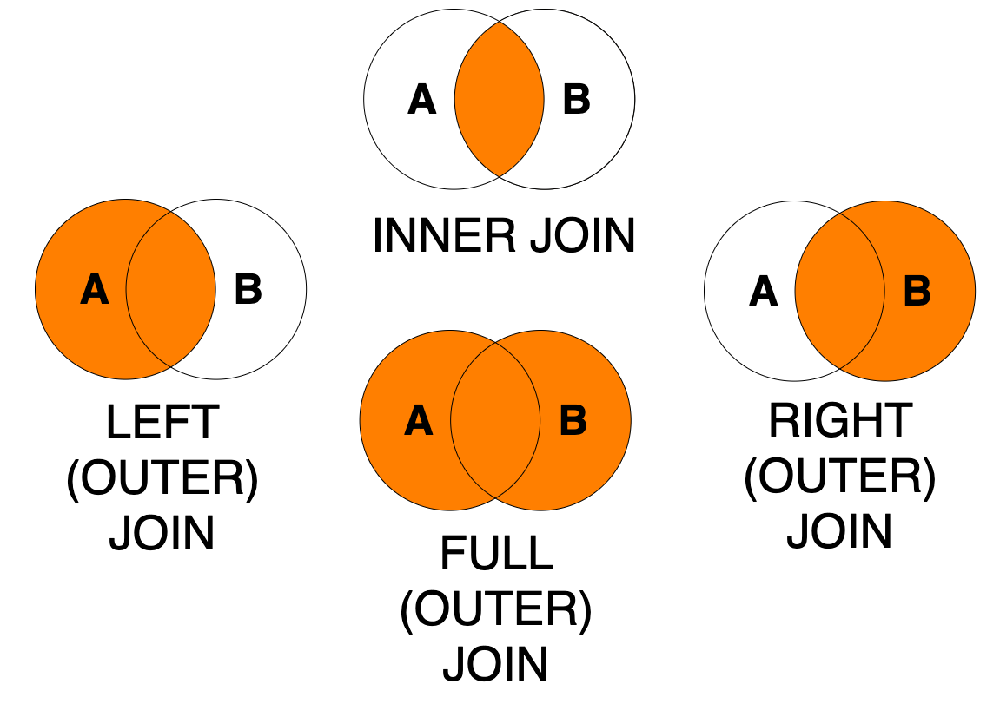

# Join operations


## Recap

**Prev**: Selection and manipulation

- Data frames and tibbles
- Data selection and filtering
- Data manipulation

**Now**: Join operations

- Joining data
- dplyr join functions


## Example


```r
cities <- data.frame(
  city_name = c("Barcelona", "London", "Rome", "Los Angeles"),
  country_name = c("Spain", "UK", "Italy", "US"),
  city_pop_M = c(1.62, 8.98, 4.34, 3.99)
)

cities_area <-data.frame(
  city_name = c("Barcelona", "London", "Rome", "Munich"),
  city_area_km2 = c(101, 1572, 496, 310)
)
```

## Example


|city_name   |country_name | city_pop_M|
|:-----------|:------------|----------:|
|Barcelona   |Spain        |       1.62|
|London      |UK           |       8.98|
|Rome        |Italy        |       4.34|
|Los Angeles |US           |       3.99|

<br/>


|city_name | city_area_km2|
|:---------|-------------:|
|Barcelona |           101|
|London    |          1572|
|Rome      |           496|
|Munich    |           310|


## Joining data

Tables can be joined (or 'merged')

- information from two tables can be combined
- specifying **column(s) from two tables with common values**
    - usually one with a unique identifier of an entity
- rows having the same value are joined
- depending on parameters
    - a row from one table can be merged with multiple rows from the other table
    - rows with no matching values in the other table can be retained
- `merge` base function or join functions in `dplyr`


## Join types

<center>
 {width=75%}
 
<br/>
<font size="4">
<a href="https://www.codeproject.com/articles/33052/visual-representation-of-sql-joins">by C.L. Moffatt</a>, licensed under <a href="https://www.codeproject.com/info/cpol10.aspx">The Code Project Open License (CPOL)</a>
</font>
<center>


## dplyr joins

`dplyr` provides [a series of join verbs](https://dplyr.tidyverse.org/reference/join.html)

- **Mutating joins**
  - `inner_join`: inner join
  - `left_join`: left join
  - `right_join`: right join
  - `full_join`: full join
- **Nesting joins**
  - `nest_join`: all rows columns from left table, plus a column of tibbles with matching from right
- **Filtering joins** (keep only columns from left)
  - `semi_join`: , rows from left where match with right
  - `anti_join`: rows from left where no match with right


## dplyr::full_join

- `full_join` combines all the available data


```r
dplyr::full_join(
  # first argument, left table
  # second argument, right table
  cities, cities_area, 
  # specify which column to be matched
  by = c("city_name" = "city_name")
  )
```

|city_name   |country_name | city_pop_M| city_area_km2|
|:-----------|:------------|----------:|-------------:|
|Barcelona   |Spain        |       1.62|           101|
|London      |UK           |       8.98|          1572|
|Rome        |Italy        |       4.34|           496|
|Los Angeles |US           |       3.99|            NA|
|Munich      |NA           |         NA|           310|


## Pipes and shorthands

When using (all) join verbs in `dplyr`


```r
# using pipe, left table is "coming down the pipe"
cities %>% 
  dplyr::full_join(cities_area, by = c("city_name" = "city_name"))

# if no columns specified, columns with the same name are matched
cities %>% 
  dplyr::full_join(cities_area)
```

|city_name   |country_name | city_pop_M| city_area_km2|
|:-----------|:------------|----------:|-------------:|
|Barcelona   |Spain        |       1.62|           101|
|London      |UK           |       8.98|          1572|
|Rome        |Italy        |       4.34|           496|
|Los Angeles |US           |       3.99|            NA|
|Munich      |NA           |         NA|           310|


## dplyr::left_join

- keeps all the data from the **left** table
  - first argument or *"coming down the pipe"*
- rows from the right table without a match are dropped
  - second argument (or first when using *pipes*)


```r
cities %>% 
  dplyr::left_join(cities_area)
```

|city_name   |country_name | city_pop_M| city_area_km2|
|:-----------|:------------|----------:|-------------:|
|Barcelona   |Spain        |       1.62|           101|
|London      |UK           |       8.98|          1572|
|Rome        |Italy        |       4.34|           496|
|Los Angeles |US           |       3.99|            NA|


## dplyr::right_join

- keeps all the data from the **right** table
  - second argument (or first when using *pipes*)
- rows from the left table without a match are dropped
  - first argument or *"coming down the pipe"*


```r
cities %>% 
  dplyr::right_join(cities_area)
```

|city_name |country_name | city_pop_M| city_area_km2|
|:---------|:------------|----------:|-------------:|
|Barcelona |Spain        |       1.62|           101|
|London    |UK           |       8.98|          1572|
|Rome      |Italy        |       4.34|           496|
|Munich    |NA           |         NA|           310|


## dplyr::inner_join

- keeps only rows that have a match in **both** tables
- rows without a match either way are dropped


```r
cities %>% 
  dplyr::inner_join(cities_area)
```

|city_name |country_name | city_pop_M| city_area_km2|
|:---------|:------------|----------:|-------------:|
|Barcelona |Spain        |       1.62|           101|
|London    |UK           |       8.98|          1572|
|Rome      |Italy        |       4.34|           496|


## dplyr::semi_join and anti_join


```r
cities %>% 
  dplyr::semi_join(cities_area)
```

|city_name |country_name | city_pop_M|
|:---------|:------------|----------:|
|Barcelona |Spain        |       1.62|
|London    |UK           |       8.98|
|Rome      |Italy        |       4.34|

<br/>


```r
cities %>% 
  dplyr::anti_join(cities_area)
```

|city_name   |country_name | city_pop_M|
|:-----------|:------------|----------:|
|Los Angeles |US           |       3.99|


## Summary

Join operations

- Joining data
- dplyr join functions

**Next**: Tidy-up your data

- Wide and long data
- Re-shape data
- Handle missing values


