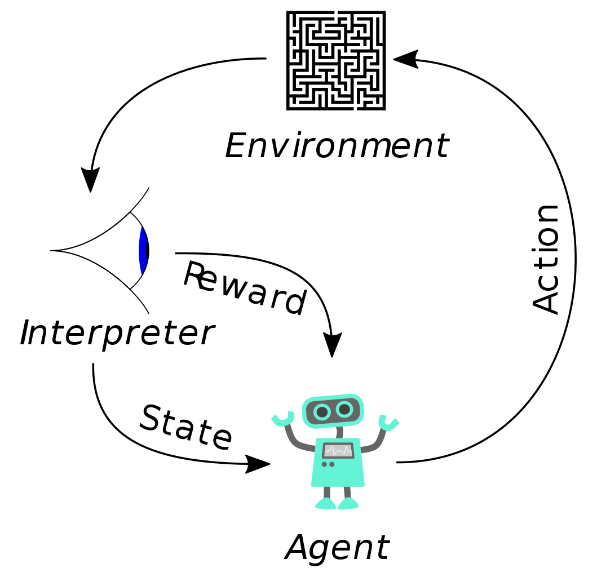

# Machine Learning

## Recap

**Prev**: Regression models

- 321 Lecture Simple regression
- 322 Lecture Assessing regression assumptions
- 323 Lecture Multiple regression
- 324 Practical session

**Now**: Machine Learning

- What's Machine Learning?
- Types
- Limitations

## Definition

 
*"The field of machine learning is concerned with the question of how to construct computer programs that automatically improve with experience."*

Mitchell, T. (1997). Machine Learning. McGraw Hill.

## Origines

- **Computer Science**: 
    - how to manually program computers to solve tasks

- **Statistics**:
    - what conclusions can be inferred from data

- **Machine Learning**:
    - intersection of **computer science** and **statistics**
    - how to get computers to **program themselves** from experience plus some initial structure
    - effective data capture, store, index, retrieve and merge 
    - computational tractability

Mitchell, T.M., 2006. The discipline of machine learning (Vol. 9). Pittsburgh, PA: Carnegie Mellon University, School of Computer Science, Machine Learning Department.

## Types of machine learning

Machine learning approaches are divided into two main types

- **Supervised**
    - training of a *"predictive"* model from data
    - one (or more) attribute of the dataset is used to "predict" another attribute
    - e.g., classification

- **Unsupervised**
    - discovery of *descriptive* patterns in data
    - commonly used in data mining
    - e.g., clustering

## Supervised

:::::: {.cols data-latex=""}

::: {.col data-latex="{0.5\textwidth}"}

- Training dataset
    - input attribute(s)
    - attribute to predict
- Testing dataset
    - input attribute(s)
    - attribute to predict
- Type of learning model
- Evaluation function
    - evaluates difference between prediction and output in testing data

:::

::: {.col data-latex="{0.5\textwidth}"}

{width=90%}

 
	
by Josef Steppan 
via Wikimedia Commons, 
CC-BY-SA-4.0

:::
::::::

## Unsupervised

:::::: {.cols data-latex=""}

::: {.col data-latex="{0.5\textwidth}"}

- Dataset
    - input attribute(s) to explore
- Type of model for the learning process
    - most approaches are iterative
    - e.g., hierarchical clustering
- Evaluation function
    - evaluates the quality of the pattern under consideration during one iteration

:::

::: {.col data-latex="{0.5\textwidth}"}

{width=90%}

 
	
by Chire 
via Wikimedia Commons, 
CC-BY-SA-3.0

:::
::::::

## Semi-supervised learning

Supervised learning requires *"labelled data"*

- which can be expensive to acquire

Semi-supervised learning

- combines a small amount of labelled data with a larger un-labelled dataset
  - train on small labelled dataset
  - apply model to larger unlabled dataset generating *"pseudo-labels"*
  - re-train the model with all data (including *"pseudo-labels"*)
- assumptions: continuity, cluster, and manifold (lower dimensionality)

## Reinforcement learning

:::::: {.cols data-latex=""}

::: {.col data-latex="{0.5\textwidth}"}

Based on the idea of training agents to learn how to

- take actions
  - which affect 
    - agent state
    - environment
  - to maximize reward
  - balancing
    - exploration (new paths/options)
    - exploitation (of current knowledge)

:::

::: {.col style="width: 70%; text-align: right;" data-latex="{0.5\textwidth}"}

 
	
by 	Megajuice 
via Wikimedia Commons, 
CC0 1.0

:::
::::::

## Limits

- Complexity
- Creating a model requires hundreds of decisions
    - variable selection and normalisation
    - model, components, algorithm
    - hyper-parameters
    - evaluation
- Black-boxes
    - recent developments in explainable artificial intelligence
    

## Overfitting

:::::: {.cols data-latex=""}

::: {.col data-latex="{0.5\textwidth}"}

- creating a model 
  - perfect for the training data
  - but not generic enough
  - to be useful for prediction
- An issue for machine learning
  - e.g., regression
    - n predictors can generate a line fitting the data exactly n cases
  - Occam's razor
  - one in ten rule
    - 10 cases per predictor 

:::

::: {.col style="width: 70%; text-align: right;" data-latex="{0.5\textwidth}"}

 
	
by Ghiles ia Wikimedia Commons, CC-BY-SA-4.0

:::
::::::

    
## Algorithmic bias

Assumptions and training dataset quality still matter!

- garbage in, garbage out

Joy Buolamwini and Timnit Gebru's work on facial recognition 

- black women were 35% less likely to be recognised than white men.
- Buolamwini, J. and Gebru, T., 2018. [Gender shades: Intersectional accuracy disparities in commercial gender classification](http://proceedings.mlr.press/v81/buolamwini18a.html?mod=article_inline). In Conference on fairness, accountability and transparency (pp. 77-91).
- see also, [Facial Recognition Is Accurate, if You’re a White Guy](https://www.nytimes.com/2018/02/09/technology/facial-recognition-race-artificial-intelligence.html) by Steve Lohr (New York Times, Feb. 9, 2018)

## Summary

Machine Learning

- What's Machine Learning?
- Types
- Limitations

**Next**:  Artificial Neural Networks

- Logistic regression
- Artificial neural networks
- Deep learning

